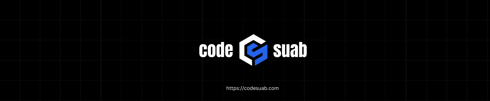

  

  <h1>Hi, I'm Sahab 👋</h1>
  
<b>Laravel Developer | React (Inertia.js) Specialist | Full-Stack Web Developer</b>

 

## About Me

- 🛜 Working on: [codesuab](https://codesuab.com)
- ⚙️ Building modern web apps with **Laravel + Inertia.js + React**
- 🎓 Computer Science Student
- 👨‍💻 Web Developer since 2018
- 🚀 Focused on scalable backend systems & clean frontend architecture

 

## Tech Stack

 

## What I Build

- ⚡ Laravel SaaS applications
- 🔗 Inertia.js SPA-like web apps
- 📊 Admin dashboards & ERP systems
- 🧩 API-driven backend systems
- 🚀 Deployment automation tools (like DeploySync)

 

## Connect With Me

